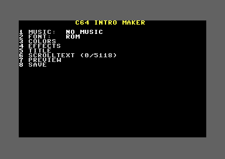
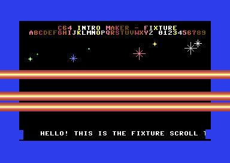
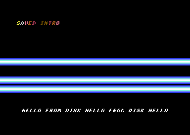

# C64 Intro Maker

A Commodore 64 program (PAL) that runs **on the C64 itself**: pick a SID tune,
a font, colours and effects, type a title and a scroll text, watch a live
preview and save the result as a **standalone, runnable PRG** on disk.

Editor and runtime live in one program. The finished intro is always complete
in RAM (`$0801` up to the end of the scroll text), so "save" is one KERNAL
`SAVE` of that range – no linker, no relocation on the C64.

| Editor | Fixture (all effects) | Saved intro |
|---|---|---|
|  |  |  |

## Features

- **Music**: any frame-based PSID/PRG tune linked to `$1000` (max. 4 KB), or no music –
  from the catalog of the intro maker disk or as a file from **any disk**
  (PSID files are checked on the C64 itself).
- **Fonts**: ROM font, bold ROM font, or 1x1 fonts (chars `$00-$3F`) from the
  catalog or from any disk.
- **Colours**: border, background, scroller and title colour.
- **Effects** (each on/off): 3 raster bars in an FLD gap with 8 colour presets,
  bar sine movement, 8 sprite balls on a sine path, title colour cycle,
  scroll speed 1/2/4.
- **Title**: 2 × 40 characters in the scroll font, or in a **big font**
  (1–4 × 1–4 characters per glyph, hires or multicolour, built-in smoothed
  ROM 2X2) – static or moving: **swing**, **sine**, horizontal **eight**,
  **bumper**, with 4 speeds.
- **Scroll text**: up to 5118 characters with inline speed changes and pauses.
- **Preview** as often as you like, then **save** – the saved file starts
  with `LOAD"NAME",8` and `RUN`; SPACE resets the machine, or starts a
  **linked program**: the intro can be put in front of any PRG from disk
  (BASIC or machine code, up to 36 KB), which runs after SPACE.
- Stable raster (double IRQ, exactly 63 cycles per line), PAL only.

## Quick start

1. Build the disk image (see below) or download `intromaker` from the latest
   [CI run](https://github.com/jhalitschke/sys2064-intro-maker/actions).
2. Start `build/intromaker.d64` in VICE (`make run`) or on a real C64:
   `LOAD"*",8` and `RUN`.

## Using the editor

Main menu – press the number key:

| Key | Screen | Keys inside |
|---|---|---|
| `1` | **MUSIC** list | CRSR up/down, RETURN loads and plays the tune, RUN/STOP back; `FROM DISK...` opens the disk directory |
| `2` | **FONT** list | CRSR up/down, RETURN loads the font, RUN/STOP back; `FROM DISK...` opens the disk directory |
| `3` | **COLORS** | `1`–`4` step border / background / scroller / title colour |
| `4` | **EFFECTS** | `1` raster bars, `2` bar sine, `3` bar colours (preset 1–8), `4` sprites, `5` title cycle, `6` scroll speed |
| `5` | **TITLE** | overwrite mode, 80 chars in 2 rows, CRSR keys, DEL, HOME, RUN/STOP back |
| `6` | **TITLE STYLE** | `1` big font list (NONE, ROM 2X2, catalog, FROM DISK), `2` movement, `3` movement speed, `4`/`5` multicolour colours |
| `7` | **SCROLLTEXT** | insert mode, CRSR keys (±1 / ±40), DEL, HOME, RUN/STOP back |
| `8` | **LINK PROGRAM** | `1` pick a PRG from disk, `2` start with RUN / SYS, `3` SYS address (hex), `4` remove |
| `9` | **PREVIEW** | SPACE returns to the editor |
| `0` | **SAVE** | type a file name (1–16 chars), RETURN saves, RUN/STOP cancels |

**Loading from any disk:** swap the disk, choose `FROM DISK...` and pick a
PRG file from the scrolling directory list. Tunes can be PSID files (copied
to the disk as they are) or PRG files loading at `$1000` (init `$1000`, play
`$1003`); RSID, CIA-timed and wrongly linked tunes are rejected with a message
and the previous tune keeps playing. Fonts are PRG files with a load address
followed by at least 512 bytes (e.g. `.64c`).

**Linking a program:** the program must be on the disk you save the intro
to. The editor measures it (this reads the whole file once), and saving
writes intro + program as one file (reads and writes it once more – a 30 KB
program takes a few minutes with the standard 1541 routines). BASIC
programs at `$0801` start with RUN, everything else with SYS at its load
address unless you enter another one. Details:
[docs/EXTENSIONS.md](docs/EXTENSIONS.md).

**Big title fonts:** a big title line holds 40 / W glyphs (20 for 2x2).
Big titles are centred; a static 1x1 title stays exactly as typed. Glyphs a
font does not contain are drawn as spaces. Multicolour fonts use title
colours 0–7 plus the two MC colours.

Scroll text control codes (shown reversed in the editor):

| Key | Code | Shown as | Effect |
|---|---|---|---|
| `F1` / `F3` / `F5` | `$F1` / `$F2` / `$F4` | `1` / `2` / `4` | scroll speed 1 / 2 / 4 pixels per frame |
| `F7` | `$F8` | `P` | pause for 100 frames (2 s) |

After saving, the status line (row 24) shows the drive status, e.g.
`00, OK,00,00` or `63, FILE EXISTS,00,00`. Existing files are never
overwritten (the 1541 `@0:` replace bug) – choose another name.

## Building

Requirements:

| Tool | Used for |
|---|---|
| [KickAssembler](http://theweb.dk/KickAssembler/) (Java) | assembling, `KICKASS ?= kickass` |
| [VICE](https://vice-emu.sourceforge.io/) `x64sc`, `c1541` | emulator, smoke/e2e tests, D64 creation |
| Python ≥ 3.11 | asset validation, catalog and disk build (standard library only) |
| [Exomizer](https://bitbucket.org/magli143/exomizer) | packing the editor (`exomizer sfx sys`) |
| `xvfb-run` | headless VICE for `make smoke` / `make e2e` |

```bash
make
```

| Target | Effect |
|---|---|
| `make` / `make disk` | test tune → editor → packed editor → `build/intromaker.d64` |
| `make fixture` | runtime test image `build/fixture.prg` (all effects on); `FIXTURE_FLAGS=<0-31>` selects effects |
| `make run` / `make run-fixture` | start in VICE |
| `make test` | unit tests of the build tools |
| `make smoke` | screenshots `build/fixture.png` and `build/editor.png` |
| `make e2e` | end-to-end tests in VICE with real key presses (~10 min, see below) |
| `make clean` | delete `build/` |

`MANIFEST=<file>` builds the disk from another asset manifest.

## Adding music and fonts

Assets are described in [`assets/manifest.toml`](assets/manifest.toml):

```toml
[[sid]]
name    = "MY TUNE"            # max. 20 chars: A-Z 0-9 space . , ! ? - : / ( )
file    = "tune-mine"          # disk name: a-z 0-9 -, max. 16, lower case
src     = "assets/sids/mine.sid"   # PSID, or .prg with init/play below
# init  = 0x1000               # required for .prg only
# play  = 0x1003
# subtune = 0                  # default: start song of the PSID
author  = "..."
license = "..."                # required

[[font]]
name    = "MY FONT"
file    = "font-mine"
src     = "assets/fonts/mine.64c"  # .64c (with load address) or .bin, >= 512 bytes
author  = "..."
license = "..."

[[bigfont]]
name    = "MY BIG FONT"
file    = "big-mine"
src     = "assets/fonts/mine-2x2.64c"  # charset with W x H chars per glyph
width   = 2
height  = 2
layout  = "linear"             # or "quad" (glyph g: chars g, g+64, g+128, g+192)
multicolor = false
author  = "..."
license = "..."
```

`tools/build_disk.py` validates everything and stops with a clear message:
RSID tunes, CIA-timed tunes, `play = 0`, tunes not linked to `$1000`
(relocate them with [sidreloc](https://www.linusakesson.net/software/sidreloc/)),
data outside `$1000-$1FFF`, fonts under 512 bytes. Up to 15 tunes, 15 fonts
and 12 big fonts fit into the catalog. Big fonts are converted to the
format described in [docs/EXTENSIONS.md](docs/EXTENSIONS.md). `build/CREDITS.txt` lists name, author and license of
every asset.

**Licensing:** only the self-written test tune is part of this repository.
Never commit third-party SIDs or fonts – `assets/sids/` and `assets/fonts/`
are git-ignored. Note that the [HVSC](https://www.hvsc.c64.org/) is an
archive, not a permission: a tune being in the HVSC does not mean you may
redistribute it in your intro. Ask the author and record the license in the
manifest.

## Testing

- **Unit tests** (`make test`): PSID parsing, rejection rules, screen code
  conversion, catalog layout, file name casing, D64 directory check.
- **Smoke test** (`make smoke`): VICE screenshots of the fixture and the
  editor, checked by eye.
- **End-to-end tests** (`make e2e`, sources in [`tests/e2e`](tests/e2e)):
  VICE runs in a private Xvfb, the tests type on the C64 keyboard via XTEST and
  inspect memory through the VICE remote monitor. They cover all 32 effect
  combinations (full-width bars exactly in raster lines 131–210, no stripes),
  scroller speed/pause, music tempo, SPACE reset, every editor screen, 10×
  preview and back, text limits, loading tunes and fonts, saving, `FILE
  EXISTS`, load errors, and the saved intro in a fresh VICE.
  Needs `python-xlib` (`apt install python3-xlib`) and the VICE ROMs;
  `make e2e E2E=test_editor` runs one file.

CI (GitHub Actions) runs the unit tests and builds the disk and the fixture;
the end-to-end tests need the VICE ROMs and run locally.

## How it works

```
$0801  BASIC stub "10 SYS2064"      $2000  font, big font tiles $2200
$0810  JMP editor_start / runtime   $2800  config block, runtime work
$0813  runtime code                 $2900  sine table, runtime code 2
$0FC0  sprite                       $2C00  scroll text ... $FF
$1000  SID (max. 4 KB)              $3FFF  $00 (VIC idle byte)
------------------------------------------------ saved intro ends here
                                    (linked: mover $4000, program $40B0)
$4000  editor   $6800  catalog   $7000  file buffer   $9A00  editor vars
$E000  runtime tables in RAM under the KERNAL (built at start)
```

The runtime uses five raster IRQs per frame: TOP (title fine scroll,
sprites), MID (end of the title band), BARS (double IRQ for a stable raster,
then an 80-line FLD loop of exactly 63 cycles that writes `$D020/$D021` in
the horizontal blank, then the bar buffers for the next frame), SCROLL
(38 columns + x-scroll) and BOTTOM (music, scroller, title movement, SPACE).
The main loop redraws a moving title and runs the colour cycle. Saving
patches the entry `JMP` to `runtime_start`, saves `$0801`–end of text and
patches it back.

Details: [docs/SPEC.md](docs/SPEC.md) (specification),
[docs/EXTENSIONS.md](docs/EXTENSIONS.md) (disk browser, big fonts,
movement, linker, memory map changes),
[docs/QUESTIONS.md](docs/QUESTIONS.md) (open questions and deviations),
[CLAUDE.md](CLAUDE.md) (notes for coding agents).

## Project layout

```
src/main.asm            stub, entry JMP, imports (FIXTURE build via -define)
src/shared/             memmap.asm (all addresses), config.asm (all constants)
src/runtime/            runtime, IRQ chain, scroller, bars, sprites, colour cycle, tables
src/editor/             editor, UI, lists, text editors, disk, fonts, editor IRQ
src/fixture.asm         runtime test image
assets/                 manifest, test tune
tools/                  build_disk.py + unit tests
tests/e2e/              VICE end-to-end tests
.claude/skills/         task guides for coding agents
```

## License

[0BSD](LICENSE) (BSD Zero Clause): use, copy, modify and distribute this
software – including the intros you make with it – for any purpose, with or
without fee, without any conditions. This covers the code and the own test
tune; third-party music and fonts you put on a disk keep their own licenses.
